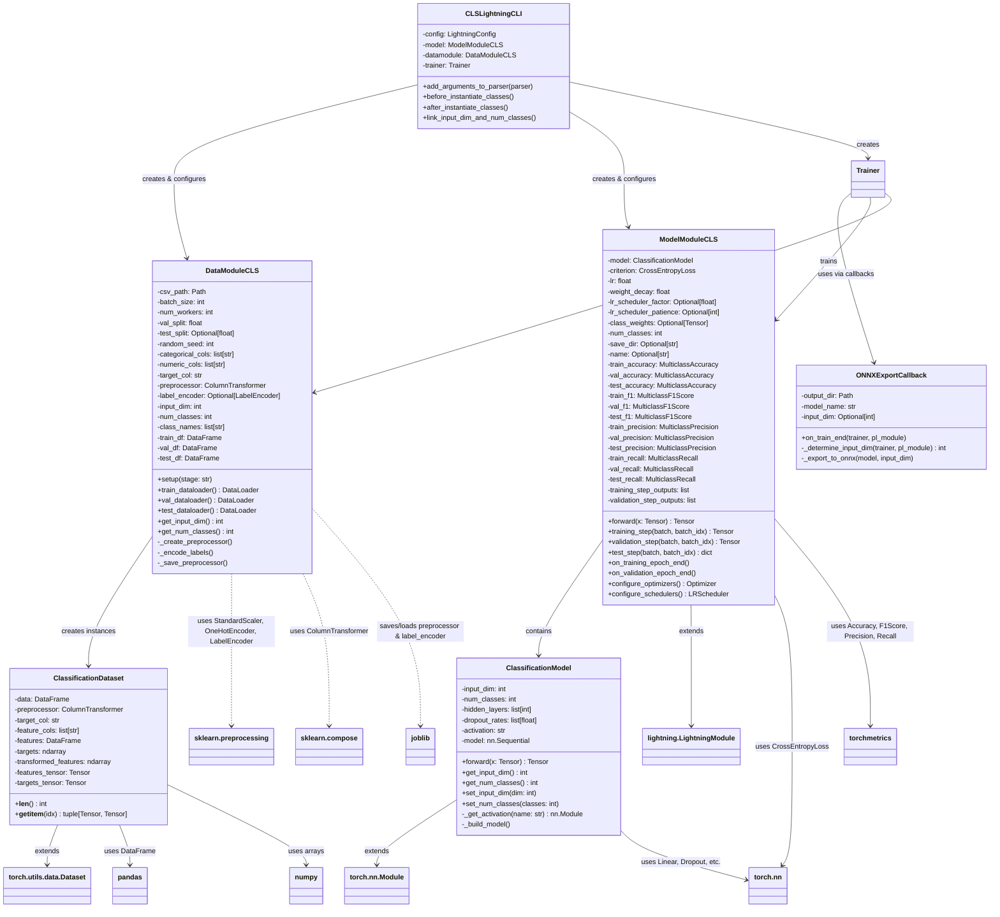
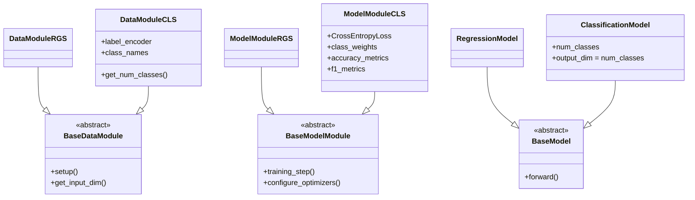
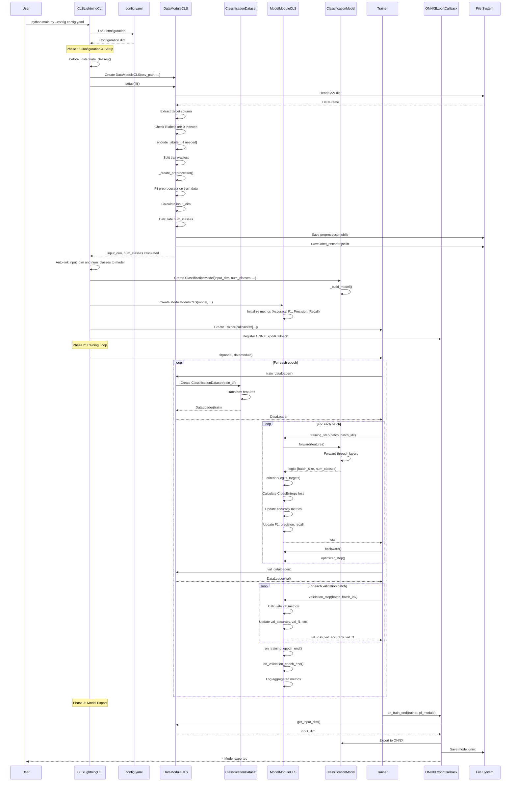
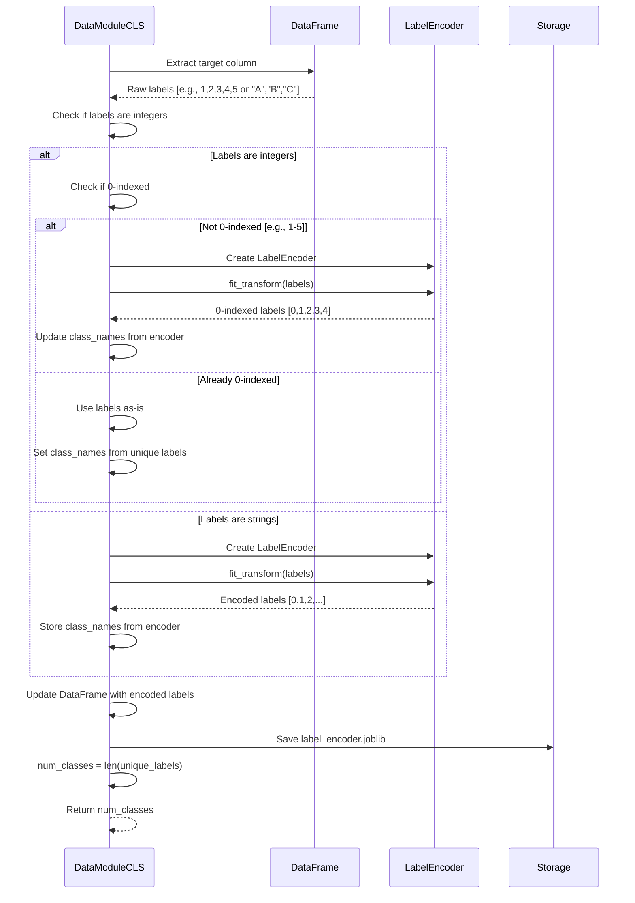
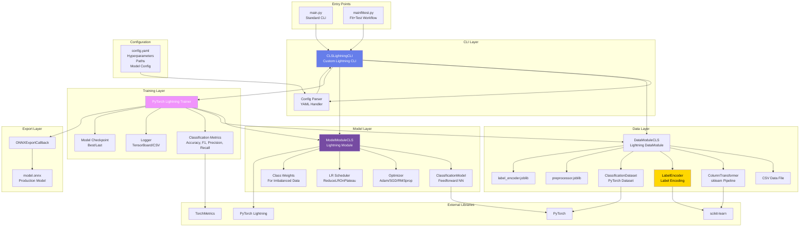

# Classification Module - UML Diagrams & Architecture Documentation

This document provides comprehensive UML diagrams and architectural documentation for the Classification module, a reusable PyTorch Lightning pipeline for tabular classification tasks.

## Table of Contents

1. [Architecture Overview](#architecture-overview)
2. [Class Diagrams](#class-diagrams)
3. [Sequence Diagrams](#sequence-diagrams)
4. [Component Diagrams](#component-diagrams)
5. [Activity Diagrams](#activity-diagrams)
6. [Class-Level Details](#class-level-details)

---

## Architecture Overview

The Classification module is a generic, config-driven pipeline for training classification models on tabular data. It extends the Regression module's architecture with classification-specific features:

- **Multi-class Classification**: Supports any number of classes
- **Classification Metrics**: Accuracy, F1-Score, Precision, Recall
- **Class Weights**: Handles imbalanced datasets
- **Label Encoding**: Auto-encodes categorical labels to 0-indexed integers
- **Probability Outputs**: Softmax for class probabilities

Key differences from Regression:
- Output dimension = number of classes (not 1)
- Loss function = CrossEntropyLoss (not MSELoss)
- Metrics = Classification metrics (not regression metrics)
- Label preprocessing = Automatic encoding to ensure 0-indexed labels

---

## Class Diagrams

### Complete Class Diagram

### Key Differences from Regression

---

## Sequence Diagrams

### Training Workflow Sequence

### Label Encoding Sequence

---

## Component Diagrams

### System Architecture

---

## Activity Diagrams

### Classification Training Process

```mermaid
flowchart TD
    Start([Start Training]) --> LoadConfig[Load config.yaml]
    LoadConfig --> ParseConfig[Parse Configuration]
    ParseConfig --> CreateDM[Create DataModuleCLS]
    CreateDM --> SetupDM[Setup DataModule]
    SetupDM --> LoadCSV[Load CSV Data]
    LoadCSV --> ExtractTargets[Extract Target Column]
    ExtractTargets --> CheckLabels{Label Type?}
    
    CheckLabels -->|Integers| CheckIndexed{0-indexed?}
    CheckLabels -->|Strings| EncodeStrings[Encode with LabelEncoder]
    
    CheckIndexed -->|Yes| UseAsIs[Use labels as-is]
    CheckIndexed -->|No| RemapIntegers[Remap to 0-indexed]
    
    EncodeStrings --> GetClasses
    UseAsIs --> GetClasses
    RemapIntegers --> GetClasses
    
    GetClasses[Get num_classes & class_names] --> SplitData{Split Data?}
    SplitData -->|Yes| TrainValTest[Split: Train/Val/Test]
    SplitData -->|No| TrainVal[Split: Train/Val]
    
    TrainValTest --> CreatePreprocessor[Create Preprocessor]
    TrainVal --> CreatePreprocessor
    CreatePreprocessor --> FitPreprocessor[Fit Preprocessor on Train]
    FitPreprocessor --> CalcInputDim[Calculate input_dim]
    CalcInputDim --> SaveArtifacts{Save Artifacts?}
    SaveArtifacts -->|Yes| SavePrep[Save preprocessor.joblib<br/>Save label_encoder.joblib]
    SaveArtifacts -->|No| CreateModel
    SavePrep --> CreateModel[Create ClassificationModel]
    
    CreateModel --> LinkDims[Auto-link input_dim & num_classes]
    LinkDims --> CreateModule[Create ModelModuleCLS]
    CreateModule --> InitMetrics[Initialize Metrics<br/>Accuracy, F1, Precision, Recall]
    InitMetrics --> CreateTrainer[Create Trainer]
    CreateTrainer --> AddCallbacks[Add Callbacks]
    
    AddCallbacks --> StartTraining[Start Training Loop]
    StartTraining --> Epoch{More Epochs?}
    
    Epoch -->|Yes| TrainBatch[Process Training Batch]
    TrainBatch --> ForwardPass[Forward Pass]
    ForwardPass --> CalcLoss[Calculate CrossEntropy Loss]
    CalcLoss --> UpdateMetrics[Update Classification Metrics]
    UpdateMetrics --> Backward[Backward Pass]
    Backward --> UpdateWeights[Update Weights]
    UpdateWeights --> ValBatch{Validation?}
    
    ValBatch -->|Yes| ValForward[Validation Forward]
    ValForward --> ValMetrics[Calculate Val Metrics<br/>Accuracy, F1, Precision, Recall]
    ValMetrics --> LogMetrics[Log Metrics]
    LogMetrics --> Checkpoint{Save Checkpoint?}
    
    ValBatch -->|No| Checkpoint
    Checkpoint -->|Yes| SaveCheckpoint[Save Model]
    Checkpoint -->|No| Epoch
    SaveCheckpoint --> Epoch
    
    Epoch -->|No| ExportONNX[Export to ONNX]
    ExportONNX --> End([Training Complete])
    
    style Start fill:#90EE90
    style End fill:#FFB6C1
    style ExportONNX fill:#87CEEB
    style EncodeStrings fill:#FFD700
    style RemapIntegers fill:#FFD700
```

---

## Class-Level Details

### CLSLightningCLI

**Purpose**: Custom CLI extending LightningCLI with classification-specific auto-linking.

**Key Responsibilities**:
- Parse YAML configuration
- Instantiate DataModule, Model, and Trainer
- Auto-link both `input_dim` and `num_classes` from DataModule to Model
- Handle checkpoint paths

**Key Methods**:
- `before_instantiate_classes()`: Auto-detects `input_dim` and `num_classes`
- `after_instantiate_classes()`: Fallback to set dimensions if needed

**Difference from Regression**: Also links `num_classes` in addition to `input_dim`.

---

### DataModuleCLS

**Purpose**: Manages data loading, preprocessing, and label encoding for classification.

**Key Responsibilities**:
- Load CSV data
- **Encode labels** to ensure 0-indexed integers (critical for CrossEntropyLoss)
- Create and fit preprocessing pipeline
- Split data into train/val/test
- Calculate input dimensions and number of classes
- Save preprocessor and label encoder

**Key Attributes**:
- `label_encoder`: sklearn LabelEncoder (for string labels or remapping)
- `num_classes`: Number of unique classes
- `class_names`: List of class names (for mapping predictions back)

**Key Methods**:
- `_encode_labels()`: Ensures labels are 0-indexed integers
- `get_num_classes()`: Returns number of classes
- `get_input_dim()`: Returns calculated input dimension

**Critical Feature**: Automatically remaps 1-indexed integer labels (e.g., 1-5) to 0-indexed (0-4) to match CrossEntropyLoss requirements.

---

### ClassificationDataset

**Purpose**: PyTorch Dataset for classification data with encoded labels.

**Key Difference from RegressionDataset**: Targets are LongTensor (integers) not FloatTensor (floats).

---

### ModelModuleCLS

**Purpose**: PyTorch Lightning module for classification with multi-class metrics.

**Key Responsibilities**:
- Define training/validation/test steps
- Use CrossEntropyLoss (not MSELoss)
- Track classification metrics: Accuracy, F1, Precision, Recall
- Support class weights for imbalanced data

**Key Attributes**:
- `criterion`: CrossEntropyLoss (with optional class weights)
- `train_accuracy`, `val_accuracy`, `test_accuracy`: MulticlassAccuracy metrics
- `train_f1`, `val_f1`, `test_f1`: MulticlassF1Score metrics
- Similar for Precision and Recall

**Key Methods**:
- `training_step()`: Returns CrossEntropy loss
- `validation_step()`: Updates accuracy, F1, precision, recall
- `on_training_epoch_end()`: Aggregates and logs metrics

---

### ClassificationModel

**Purpose**: Feedforward neural network for classification.

**Key Difference from RegressionModel**:
- `output_dim` = `num_classes` (not 1)
- Output layer size matches number of classes
- Forward pass produces logits for each class

**Key Methods**:
- `get_num_classes()`: Returns number of classes
- `set_num_classes()`: Sets number of classes if not known at init

---

## Key Design Patterns

1. **Template Method Pattern**: Lightning framework defines training loop
2. **Factory Pattern**: ModelFactory creates model instances
3. **Strategy Pattern**: Configurable optimizers, schedulers, activations
4. **Adapter Pattern**: LabelEncoder adapts labels to 0-indexed format
5. **Observer Pattern**: Callbacks observe training events

---

## Critical Implementation Details

### Label Encoding Strategy

The module ensures labels are always 0-indexed for CrossEntropyLoss:

1. **Integer Labels (e.g., 1-5)**:
   - Check if min label = 0
   - If not, remap: `encoded = original - min(original)`
   - Update class_names to reflect remapping

2. **String Labels (e.g., "cat", "dog")**:
   - Use LabelEncoder to map to 0, 1, 2, ...
   - Store mapping for inverse transform

3. **Already 0-indexed**:
   - Use as-is
   - Extract class_names from unique values

### Metrics Calculation

- **Accuracy**: Percentage of correct predictions
- **F1-Score**: Harmonic mean of precision and recall (macro-averaged)
- **Precision**: True positives / (True positives + False positives)
- **Recall**: True positives / (True positives + False negatives)

All metrics use macro-averaging (average across classes).

---

*Last Updated: [Current Date]*
