# Stress Level Prediction API - UML Diagrams & Architecture Documentation

This document provides comprehensive UML diagrams and architectural documentation for the Stress Level Prediction API, showing how the ONNX model is integrated with FastAPI and how the web interface connects to the inference pipeline.

## Table of Contents

1. [Architecture Overview](#architecture-overview)
2. [Class Diagrams](#class-diagrams)
3. [Sequence Diagrams](#sequence-diagrams)
4. [Component Diagrams](#component-diagrams)
5. [Activity Diagrams](#activity-diagrams)
6. [Class-Level Details](#class-level-details)

---

## Architecture Overview

The Stress Level Prediction API is a production-ready inference service that serves a trained classification model via FastAPI. It predicts employee stress levels (1-5 scale) based on tabular employee data.

**Key Components**:
- **FastAPI Application**: HTTP server with web UI and REST API
- **ONNX Runtime**: Efficient model inference engine
- **Predictor Service**: Handles data preprocessing and ONNX inference
- **Preprocessor**: sklearn ColumnTransformer (one-hot encoding, scaling)
- **Label Encoder**: Maps model output (0-4) back to stress levels (1-5)
- **Web Interface**: Jinja2-templated HTML with form inputs

**Architecture Layers**:
1. **Presentation Layer**: Web UI (HTML/CSS/JS) and REST API
2. **Application Layer**: FastAPI routes and request handling
3. **Service Layer**: Predictor class (preprocessing + inference)
4. **Model Layer**: ONNX Runtime with loaded model
5. **Data Layer**: Model files (ONNX, preprocessor, label encoder)

**Key Differences from Image Classification**:
- **Input Type**: Tabular form data (not images)
- **Preprocessing**: sklearn ColumnTransformer (not image transforms)
- **Data Source**: Form fields (not file upload)
- **Output Mapping**: Label encoder maps 0-indexed to 1-5 stress levels

---

## Class Diagrams

### Complete Class Diagram

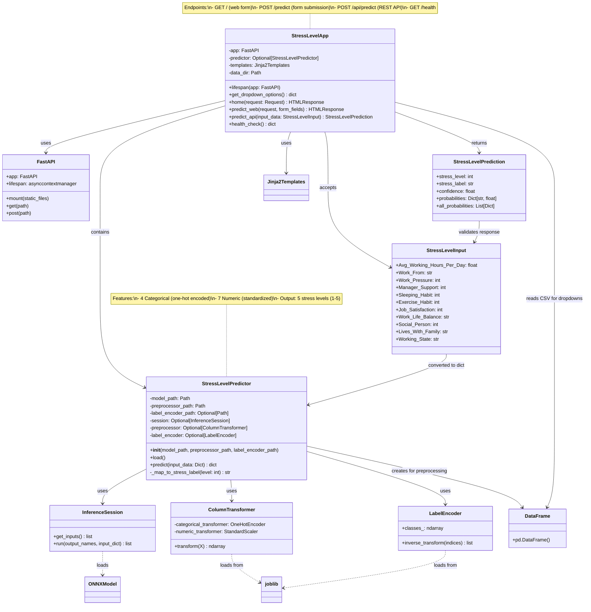

### Data Preprocessing Flow

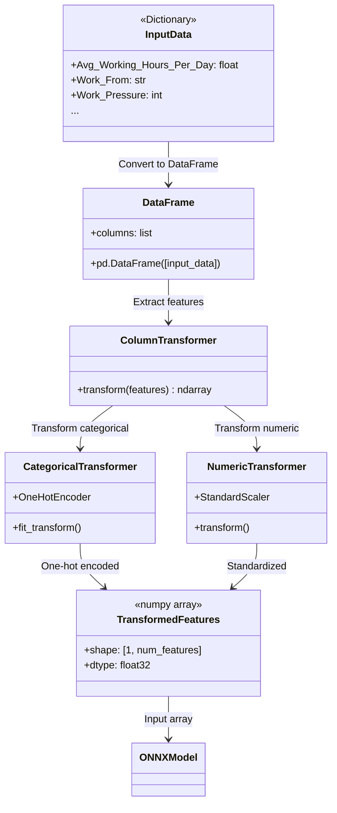

---

## Sequence Diagrams

### Web Form Prediction Flow

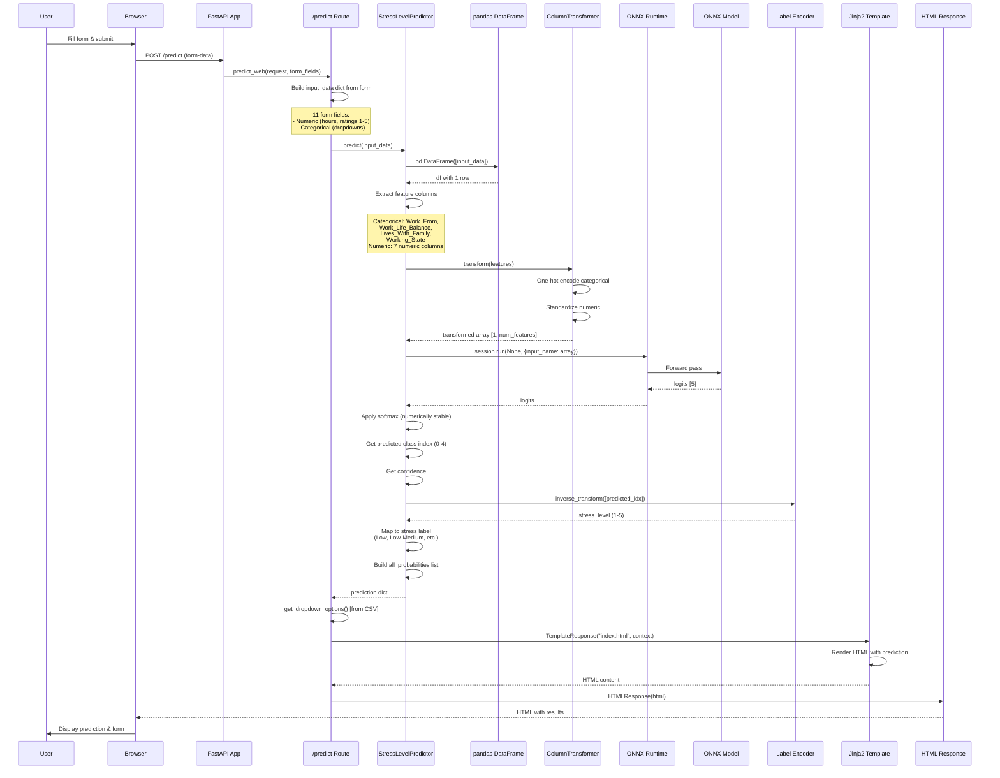

### REST API Prediction Flow

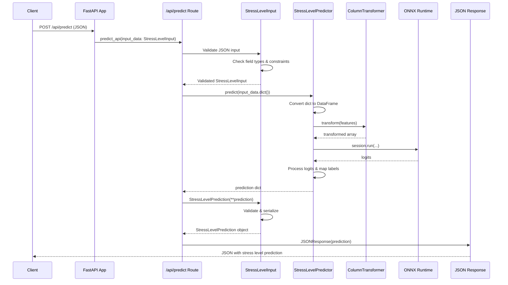

### Application Startup Sequence

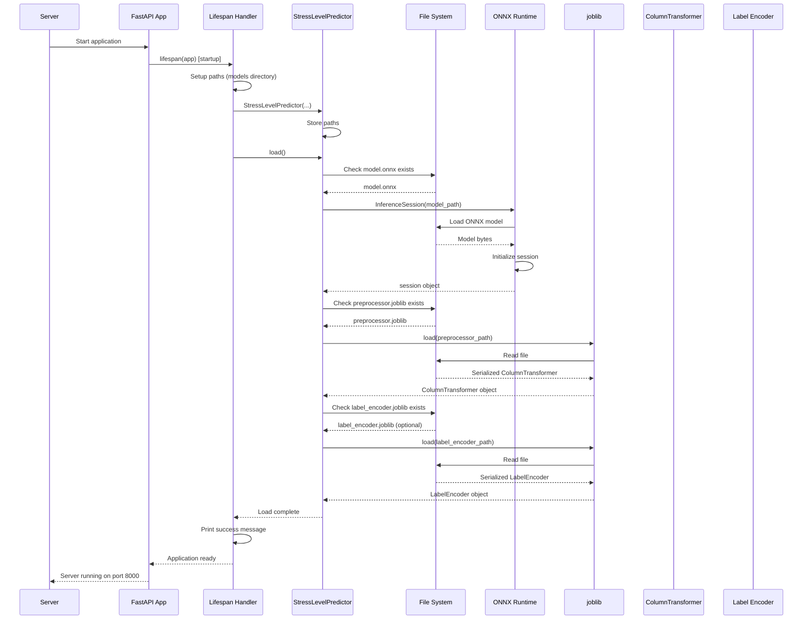

### Data Preprocessing Sequence

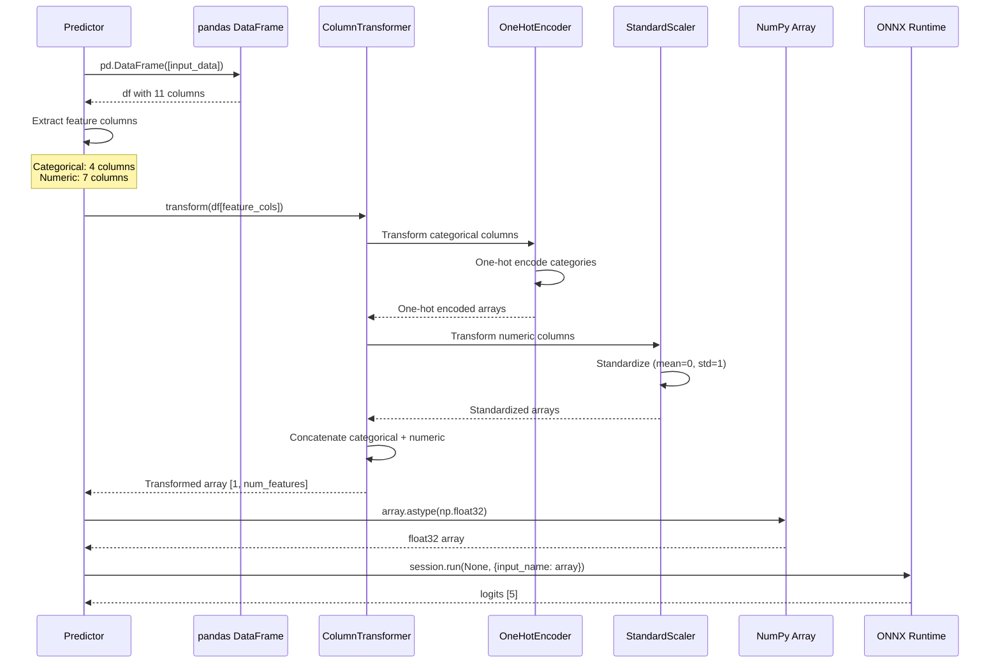

---

## Component Diagrams

### System Architecture

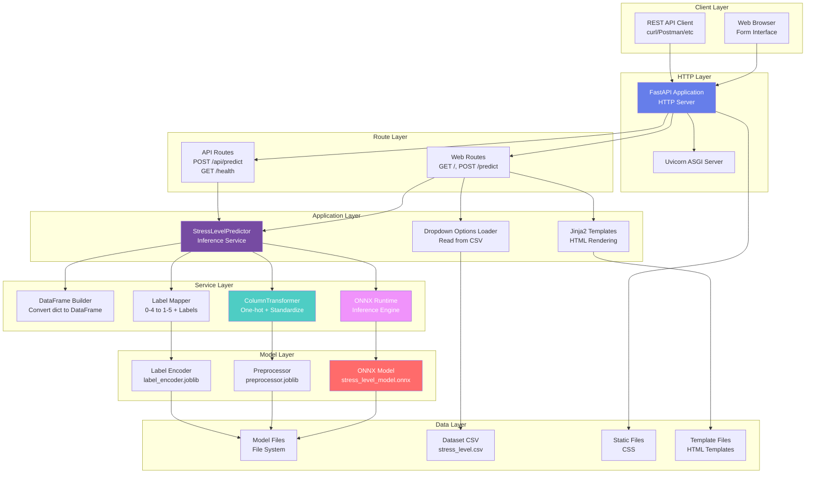

### Request Processing Pipeline

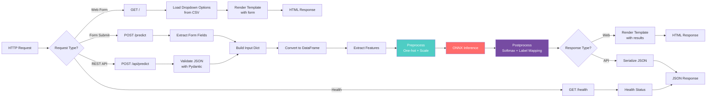

---

## Activity Diagrams

### Complete Prediction Workflow

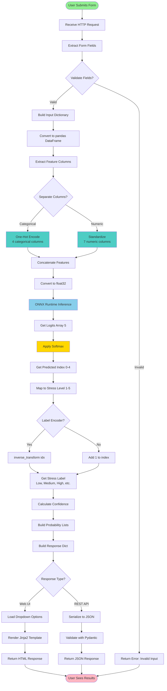

### Application Startup Workflow

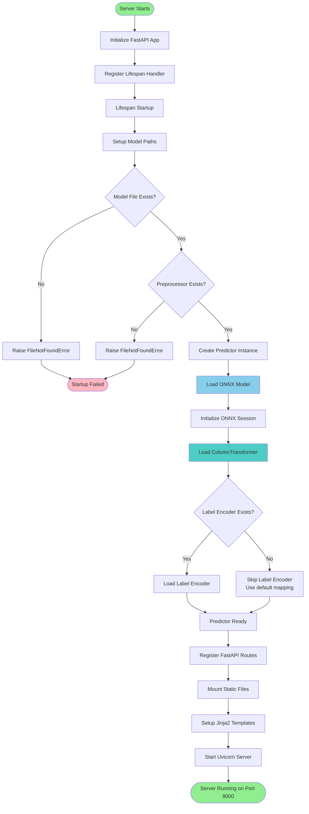

### Form Data Preprocessing Workflow

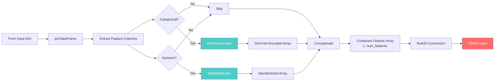

---

## Class-Level Details

### StressLevelApp (main.py)

**Purpose**: FastAPI application that serves the stress level prediction web interface and REST API.

**Key Responsibilities**:
- Initialize FastAPI app with lifespan events
- Register HTTP routes (web UI and REST API)
- Handle form submissions
- Load dropdown options from dataset CSV
- Coordinate between predictor and templates
- Serve static files and templates

**Key Attributes**:
- `app`: FastAPI application instance
- `predictor`: Global predictor instance (loaded at startup)
- `templates`: Jinja2 template engine
- `data_dir`: Directory containing dataset CSV

**Key Methods**:
- `lifespan()`: Startup/shutdown handler (loads model)
- `get_dropdown_options()`: Reads CSV to get unique values for dropdowns
- `home()`: Renders main form page (GET /)
- `predict_web()`: Handles form submission (POST /predict)
- `predict_api()`: REST API endpoint (POST /api/predict)
- `health_check()`: Health check endpoint (GET /health)

**Endpoints**:
1. `GET /` - Web interface home page (form)
2. `POST /predict` - Web form submission (returns HTML)
3. `POST /api/predict` - REST API (returns JSON)
4. `GET /health` - Health check

**Form Fields** (11 inputs):
- `Avg_Working_Hours_Per_Day`: float (0-24)
- `Work_From`: str (dropdown: Home/Office/Hybrid)
- `Work_Pressure`: int (slider: 1-5)
- `Manager_Support`: int (slider: 1-5)
- `Sleeping_Habit`: int (slider: 1-5)
- `Exercise_Habit`: int (slider: 1-5)
- `Job_Satisfaction`: int (slider: 1-5)
- `Work_Life_Balance`: str (dropdown: Yes/No)
- `Social_Person`: int (slider: 1-5)
- `Lives_With_Family`: str (dropdown: Yes/No)
- `Working_State`: str (dropdown: varies)

---

### StressLevelPredictor

**Purpose**: Service class that handles data preprocessing and ONNX model inference.

**Key Responsibilities**:
- Load ONNX model, preprocessor, and label encoder at startup
- Preprocess input data (one-hot encoding, standardization)
- Run ONNX inference
- Postprocess results (softmax, label mapping, stress level labels)
- Map model output (0-4) to stress levels (1-5)

**Key Attributes**:
- `session`: ONNX Runtime InferenceSession
- `preprocessor`: sklearn ColumnTransformer (fitted)
- `label_encoder`: sklearn LabelEncoder (optional, for mapping)
- `model_path`: Path to ONNX model
- `preprocessor_path`: Path to preprocessor joblib file
- `label_encoder_path`: Path to label encoder joblib file

**Key Methods**:
- `load()`: Loads ONNX model, preprocessor, and label encoder
- `predict()`: Main prediction method (returns dict with results)
- `_map_to_stress_label()`: Maps stress level (1-5) to human-readable label

**Feature Columns**:
- **Categorical (4)**: `Work_From`, `Work_Life_Balance`, `Lives_With_Family`, `Working_State`
- **Numeric (7)**: `Avg_Working_Hours_Per_Day`, `Work_Pressure`, `Manager_Support`, `Sleeping_Habit`, `Exercise_Habit`, `Job_Satisfaction`, `Social_Person`

**Preprocessing Pipeline**:
1. Convert input dict to pandas DataFrame
2. Extract feature columns (categorical + numeric)
3. Apply ColumnTransformer:
   - Categorical → OneHotEncoder
   - Numeric → StandardScaler
4. Concatenate transformed features
5. Convert to float32 numpy array
6. Shape: `[1, num_features]` (single sample)

**Inference Pipeline**:
1. Get input name from ONNX session
2. Run session with preprocessed features
3. Get logits output (5 classes)
4. Apply softmax (numerically stable)
5. Get predicted class index (0-4)
6. Map to stress level (1-5):
   - If label encoder exists: `inverse_transform([idx])`
   - Otherwise: `idx + 1`
7. Map to stress label (Low, Medium, High, etc.)
8. Build response dictionary

**Stress Level Labels**:
- 1: "Low"
- 2: "Low-Medium"
- 3: "Medium"
- 4: "Medium-High"
- 5: "High"

---

### StressLevelInput (Pydantic Model)

**Purpose**: Input validation model for API requests.

**Key Fields** (all required):
- `Avg_Working_Hours_Per_Day`: float (0-24 range)
- `Work_From`: str (dropdown selection)
- `Work_Pressure`: int (1-5 range)
- `Manager_Support`: int (1-5 range)
- `Sleeping_Habit`: int (1-5 range)
- `Exercise_Habit`: int (1-5 range)
- `Job_Satisfaction`: int (1-5 range)
- `Work_Life_Balance`: str (Yes/No)
- `Social_Person`: int (1-5 range)
- `Lives_With_Family`: str (Yes/No)
- `Working_State`: str (dropdown selection)

**Validation**: Pydantic automatically validates field types and constraints (ge, le).

---

### StressLevelPrediction (Pydantic Model)

**Purpose**: Response model for API validation and serialization.

**Key Fields**:
- `stress_level`: Predicted stress level (1-5)
- `stress_label`: Human-readable label (Low, Medium, High, etc.)
- `confidence`: Confidence score (0-1) for prediction
- `probabilities`: Dictionary with probabilities for each class (class_1 to class_5)
- `all_probabilities`: List of dictionaries with detailed probabilities (level, label, probability)

**Validation**: Automatically validates response structure and types.

---

## Data Flow Summary

### Request Flow

1. **Client** → HTTP Request (form-data or JSON with 11 fields)
2. **FastAPI** → Route handler receives request
3. **Validator** → Validates input (Pydantic for API, form extraction for web)
4. **Predictor** → Converts to DataFrame and preprocesses
5. **ONNX Runtime** → Runs inference on model
6. **Predictor** → Postprocesses results (softmax, label mapping)
7. **Route** → Formats response (HTML or JSON)
8. **Client** ← HTTP Response with stress level prediction

### Model Loading Flow

1. **Application Startup** → Lifespan handler triggered
2. **Predictor Creation** → Initialize with model paths
3. **ONNX Loading** → Load model.onnx into InferenceSession
4. **Preprocessor Loading** → Load preprocessor.joblib (ColumnTransformer)
5. **Encoder Loading** → Load label_encoder.joblib (optional)
6. **Ready** → Predictor available for requests

### Preprocessing Flow

1. **Input Dict** → Convert to pandas DataFrame
2. **Feature Extraction** → Separate categorical and numeric columns
3. **One-Hot Encoding** → Transform 4 categorical columns
4. **Standardization** → Transform 7 numeric columns
5. **Concatenation** → Combine into single feature array
6. **Type Conversion** → Convert to float32
7. **ONNX Input** → Ready for inference

---

## Key Design Patterns

1. **Singleton Pattern**: Global predictor instance (loaded once at startup)
2. **Service Layer Pattern**: Predictor encapsulates inference logic
3. **Template Method Pattern**: FastAPI defines request/response structure
4. **Factory Pattern**: Preprocessor created from saved joblib file
5. **Adapter Pattern**: Predictor adapts ONNX model to application needs

---

## Integration Points

### ONNX Model Integration

- **Model Format**: ONNX (Open Neural Network Exchange)
- **Runtime**: ONNX Runtime (ort.InferenceSession)
- **Input Shape**: [1, num_features] (single sample, preprocessed features)
- **Output Shape**: [5] (logits for 5 stress levels)
- **Preprocessing**: Must match training preprocessing (ColumnTransformer)

### Preprocessor Integration

- **Format**: sklearn ColumnTransformer saved with joblib
- **Purpose**: One-hot encoding for categorical, standardization for numeric
- **Loading**: Loaded at startup, used for all predictions
- **Consistency**: Must match training-time preprocessing exactly

### Label Encoder Integration

- **Format**: sklearn LabelEncoder saved with joblib (optional)
- **Purpose**: Maps model output (0-indexed) to original labels (1-5)
- **Loading**: Loaded at startup if available
- **Fallback**: If not available, uses simple mapping (idx + 1)

### Web Interface Integration

- **Template Engine**: Jinja2
- **Static Files**: CSS (served via FastAPI static mount)
- **Form Inputs**: HTML form with sliders, dropdowns, number inputs
- **Dynamic Options**: Dropdown options loaded from dataset CSV
- **Interactive**: Real-time slider value display, form validation

---

## Comparison: Image vs Tabular API

| Aspect | Food Classification | Stress Level Prediction |
|--------|-------------------|------------------------|
| **Input Type** | Image files | Form data (tabular) |
| **Input Method** | File upload | Form fields |
| **Preprocessing** | Image transforms (resize, normalize) | sklearn (one-hot, standardization) |
| **Input Shape** | [1, 3, 224, 224] (image tensor) | [1, num_features] (feature vector) |
| **Output** | Food class names | Stress level (1-5) + label |
| **Model Type** | CNN | Feedforward NN |
| **Label Mapping** | Direct class names | Index to level (0-4 → 1-5) |

---

*Last Updated: [Current Date]*
